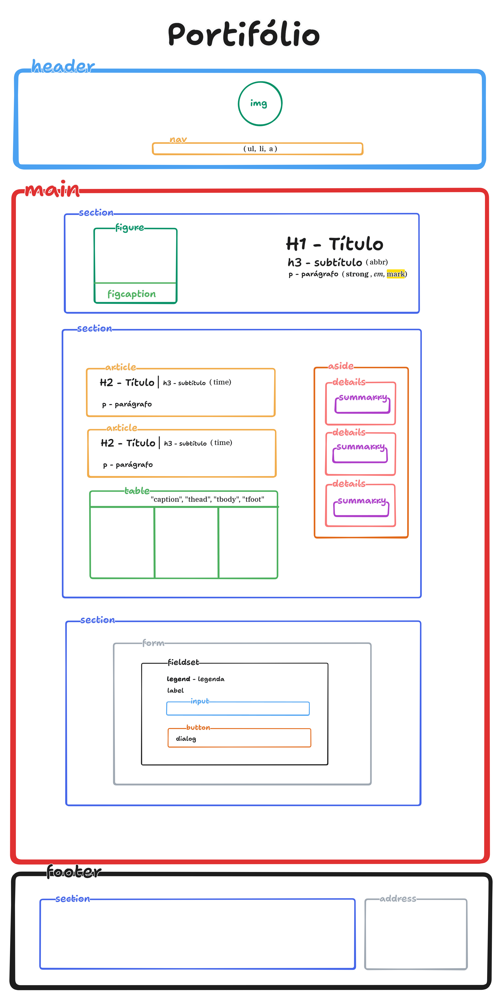

# HTML Semântico - Dominando a semântica das tags

O projeto **Portifólio** tem como objetivo demonstrar o conhecimento prático e teórico sobre as tags semânticas do HTML. 

Onde cada tag utilizada é explicada (no arquivo index.html com comentários e aqui no  README.md) o seu propósito da tag, por que foi escolhida para aquele trecho e como isso ajuda na acessibilidade/SEO/manutenção do código.

 ### Portifólio | Estrutura HTML Semântca

 

