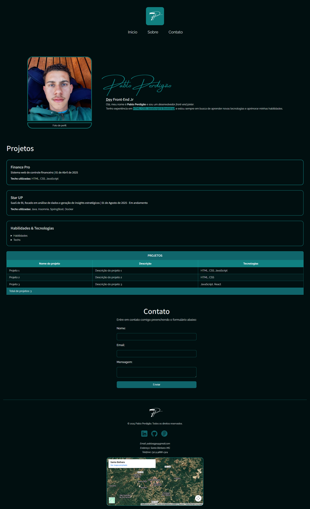

# HTML Semântico - Dominando a semântica das tags

O projeto **Portifólio** tem como objetivo demonstrar o conhecimento prático e teórico sobre as tags semânticas do HTML. 

Onde cada tag utilizada é explicada (no arquivo index.html com comentários e aqui no  README.md) o seu propósito da tag, por que foi escolhida para aquele trecho e como isso ajuda na acessibilidade/SEO/manutenção do código.

## 🚀 Visualização do Projeto

Você pode acessar a versão final do projeto (publicada com GitHub Pages) no link abaixo:

**[Clique aqui para acessar o portifólio](https://pabloperdigao.github.io/SEU-REPOSITORIO-AQUI/)**

---

## 🛠️ Tecnologias Utilizadas

* **HTML5 (Foco Semântico):** A estrutura da página foi construída seguindo as melhores práticas de semântica.
* **CSS3:** Para estilização, utilizando Flexbox, Variáveis CSS e fontes customizadas (`@font-face`).
* **Google Fonts:** Para a tipografia do projeto.

---

 ### Portifólio | Estrutura HTML Semântca

Esta tabela resume as principais escolhas estruturais e o porquê de cada tag:

| Tag | Função | Justificativa de Uso |
| :--- | :--- | :--- |
| `<header>` | Cabeçalho da página. | Agrupa os elementos de topo, como o logotipo (``) e a navegação principal (`<nav>`). |
| `<nav>` | Seção de navegação. | Contém a lista `<ul>` de links principais do site (Início, Sobre, Contato). |
| `<main>` | Conteúdo principal. | Envolve *todo* o conteúdo único da página, separando-o do `<header>` e `<footer>`. |
| `<section>`| Seção temática. | Usado 3x para agrupar logicamente os blocos de "Sobre", "Projetos" e "Contato". |
| `<article>` | Conteúdo independente. | Usado para cada projeto ("Finance Pro", "Star UP"), pois são itens que fariam sentido sozinhos em um feed. |
| `<h1>`-`<h4>`| Títulos. | Usados em ordem hierárquica estrita (H1: Nome, H2: Cargo/Seções, H3: Títulos de Projetos). |
| `<aside>` | Conteúdo agrupado. | Contém "Habilidades & Tecnologias", um conteúdo relacionado aos projetos. |
| `<figure>` | Mídia com legenda. | Agrupa a foto de perfil (``) e seu `<figcaption>`, criando uma ligação semântica entre eles. |
| `<table>` | Tabela de dados. | Usada para listar os "Detalhes dos Projetos" de forma estruturada, com `<thead>`, `<tbody>` e `<tfoot>`. |
| `<form>` | Formulário interativo. | Usado na seção "Contato" para coletar dados do usuário. |
| `<fieldset>`| Agrupamento de campos. | Agrupa visual e semanticamente os campos do formulário de contato, com um `<legend>` descritivo. |
| `<footer>` | Rodapé da página. | Contém informações secundárias, como copyright, redes sociais e informações de contato (`<address>`). |
| `<address>` | Informação de contato. | Fornece dados de contato do autor (email, telefone, localização) dentro do rodapé. |

---

## ♿ Acessibilidade & SEO

A semântica não é apenas organização; é o pilar para tornar a web acessível e otimizada.

* **Atributos `alt`:** Todas as tags `` (logo, foto de perfil, ícones) possuem um atributo `alt` que descreve a imagem para leitores de tela.
* **Hierarquia de Títulos:** O uso correto de `<h1>` a `<h4>` permite que usuários de leitores de tela "pulem" para a seção de interesse.
* **Atributo `lang`:** Essencial para que o leitor de tela use a pronúncia correta (Português do Brasil).
* **Tags de Formulário:** O uso de `<label for="id">` conecta o rótulo ao seu `input`, melhorando a acessibilidade para quem navega via teclado.

### ⭐ Bônus Técnico: Atributos ARIA

Para cumprir o bônus, foram utilizados atributos `aria-label` nos links de redes sociais no rodapé. Como esses links contêm apenas um ícone (``), o `aria-label` fornece um texto descritivo (ex: "Link para o LinkedIn") para leitores de tela, garantindo que o propósito do link seja claro.

---

## 👨‍💻 Autor

**Pablo Perdigão**

* **LinkedIn:** [linkedin.com/in/pabloperdigao](https://www.linkedin.com/in/pabloperdigao/)
* **GitHub:** [github.com/pabloperdigao](https://github.com/pabloperdigao)

